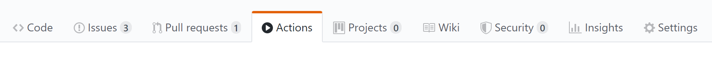

# HOUSING PRICE PREDICTION USING MACHINE LEARNING

## DESCRIPTION 
##### Housing Price Prediction Using Machine Learning is to predict the data of housings. Here I have included many data features. The most important feature according to the builders perspective view would be Bedroom. Sometimes it’s very important for a builder to check which is the highest selling house type which enables the builder to make houses which are more than 3 bedrooms. In the output section you would be seeing the visualization of 3 bedroom houses that are most commonly sold followed by 4 bedroom. The main Aim of this project is to make a model which can give a good prediction on the price of the house based on other variables. 

## PROGRAMMING LANGUAGE USED
##### PYTHON
##
## AZURE TECHNOLOGIES USED 
##### AZURE MACHINE LEARNING 
##### AZURE CLOUD SHELL
##### VISUAL STUDIO CODE

## CODE EXPLANATION

## UPLOADING CODE TO AZURE MACHINE LEARNING STUDIO STEPS
STEP 1 : Login to your Azure Portal 
STEP 2 : Create a Resource Group
STEP 3 : In resource group click on create 
STEP 4 : Go to Categories and under that select AI + Machine Learning.
STEP 5: Select Machine Learning and click on create.  
STEP 6 : In Basic Section under project details select your subscription and resource group. After that in Workspace details specify your Workspace name and select your nearest region.  
STEP 7 : Click on Review + Create and the Deployment progress will start.
STEP 8 : After a sucessfull deployment launched Azure Machine Learning Studio to build and deploy the machine learning models.
STEP 9 : Create a new notebook in azure machine learning studio and uploaded your code.
STEP 10 : Next step is to upload the code in GitHub. So here, I have used Azure Cloud Shell. 
STEP 11 : Log in to GitHub Account and create a repository name.
STEP 12 : Follow the below steps.

# ML Ops WITH GITHUB ACTIONS AND AZURE MACHINE LEARNING

<p align="center">
  
  
  
</p>

This template can be used for easily setting up a data science or machine learning project with automated training and deployment using [GitHub Actions](https://github.com/features/actions) and [Azure Machine Learning](https://docs.microsoft.com/en-us/azure/machine-learning/). For a more comprehensive version of this automated pipeline, see the [aml-template](https://github.com/Azure/aml-template) repository.

# Getting started

### 1. Prerequisites

The following prerequisites are required to make this repository work:
- Azure subscription
- Contributor access to the Azure subscription
- Access to [GitHub Actions](https://github.com/features/actions)

If you don’t have an Azure subscription, create a free account before you begin. Try the [free or paid version of Azure Machine Learning](https://aka.ms/AMLFree) today.

### 2. Create repository

To get started with ML Ops, simply create a new repo based off this template, by clicking on the green "Use this template" button:

<p align="center">
  
</p>

### 3. Setting up the required secrets

A service principal needs to be generated for authentication and getting access to your Azure subscription. We suggest adding a service principal with contributor rights to a new resource group or to the one where you have deployed your existing Azure Machine Learning workspace. Just go to the Azure Portal to find the details of your resource group or workspace. Then start the Cloud CLI or install the [Azure CLI](https://docs.microsoft.com/en-us/cli/azure/install-azure-cli?view=azure-cli-latest) on your computer and execute the following command to generate the required credentials:

```sh
# Replace {service-principal-name}, {subscription-id} and {resource-group} with your 
# Azure subscription id and resource group name and any name for your service principle
az ad sp create-for-rbac --name {service-principal-name} \
                         --role contributor \
                         --scopes /subscriptions/{subscription-id}/resourceGroups/{resource-group} \
                         --sdk-auth
```

This will generate the following JSON output:

```sh
{
  "clientId": "<GUID>",
  "clientSecret": "<GUID>",
  "subscriptionId": "<GUID>",
  "tenantId": "<GUID>",
  (...)
}
```

Add this JSON output as [a secret](https://help.github.com/en/actions/configuring-and-managing-workflows/creating-and-storing-encrypted-secrets#creating-encrypted-secrets) with the name `AZURE_CREDENTIALS` in your GitHub repository:

<p align="center">
  
</p>

To do so, click on the Settings tab in your repository, then click on Secrets and finally add the new secret with the name `AZURE_CREDENTIALS` to your repository.

Please follow [this link](https://help.github.com/en/actions/configuring-and-managing-workflows/creating-and-storing-encrypted-secrets#creating-encrypted-secrets) for more details. 

### 4. Define your workspace parameters

You have to modify the parameters in the <a href="/.cloud/.azure/workspace.json">`/.cloud/.azure/workspace.json"` file</a> in your repository, so that the GitHub Actions create or connect to the desired Azure Machine Learning workspace. Just click on the link and edit the file.

Please use the same value for the `resource_group` parameter that you have used when generating the azure credentials. If you already have an Azure ML Workspace under that resource group, change the `name` parameter in the JSON file to the name of your workspace, if you want the Action to create a new workspace in that resource group, pick a name for your new workspace, and assign it to the `name` parameter. You can also delete the `name` parameter, if you want the action to use the default value, which is the repository name.

Once you save your changes to the file, the predefined GitHub workflow that trains and deploys a model on Azure Machine Learning gets triggered. Check the actions tab to view if your actions have successfully run.

<p align="center">
  
</p>

### 5. Modify the code

Now you can start modifying the code in the <a href="/code">`code` folder</a>, so that your model and not the provided sample model gets trained on Azure. Where required, modify the environment yaml so that the training and deployment environments will have the correct packages installed in the conda environment for your training and deployment.
Upon pushing the changes, actions will kick off your training and deployment run. Check the actions tab to view if your actions have successfully run.

Comment lines 39 to 55 in your <a href="/.github/workflows/train_deploy.yml">`"/.github/workflows/train_deploy.yml"` file</a> if you only want to train the model. Uncomment line 7 to 8, if you only want to kick off the workflow when pushing changes to the `"/code/"` file.

### 6. Viewing your AML resources and runs

The log outputs of your action will provide URLs for you to view the resources that have been created in AML. Alternatively, you can visit the [Machine Learning Studio](https://ml.azure.com/) to view the progress of your runs, etc. For more details, read the documentation below.


# Contributing

This project welcomes contributions and suggestions.  Most contributions require you to agree to a
Contributor License Agreement (CLA) declaring that you have the right to, and actually do, grant us
the rights to use your contribution. For details, visit https://cla.opensource.microsoft.com.

When you submit a pull request, a CLA bot will automatically determine whether you need to provide
a CLA and decorate the PR appropriately (e.g., status check, comment). Simply follow the instructions
provided by the bot. You will only need to do this once across all repos using our CLA.

This project has adopted the [Microsoft Open Source Code of Conduct](https://opensource.microsoft.com/codeofconduct/).
For more information see the [Code of Conduct FAQ](https://opensource.microsoft.com/codeofconduct/faq/) or
contact [opencode@microsoft.com](mailto:opencode@microsoft.com) with any additional questions or comments.

